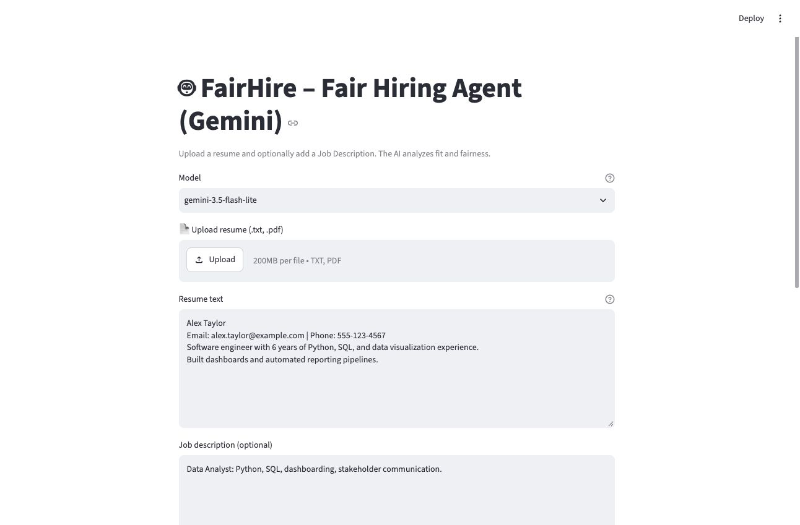
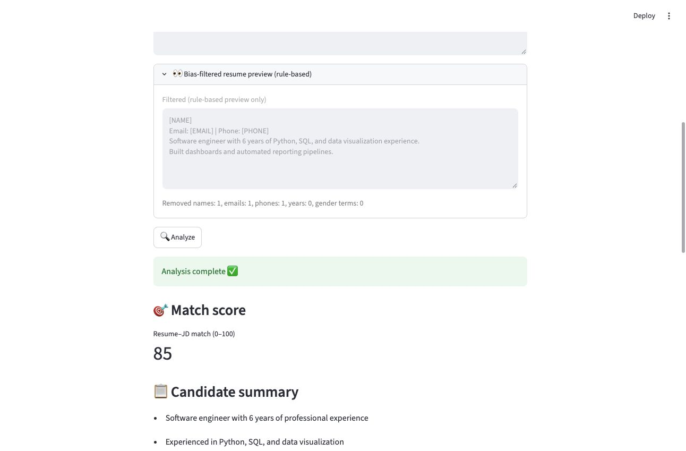
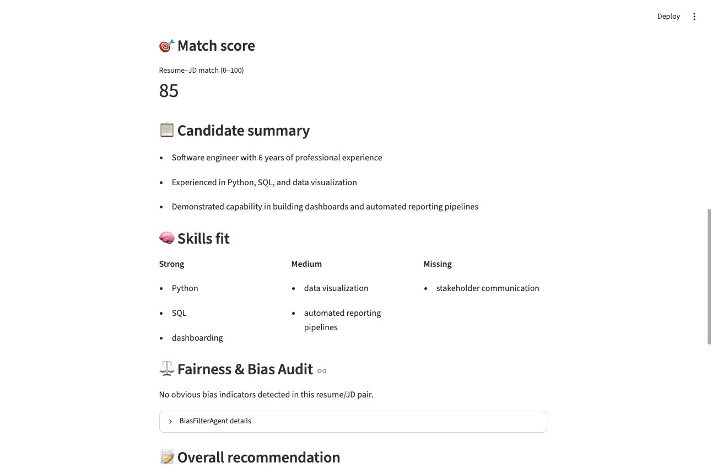
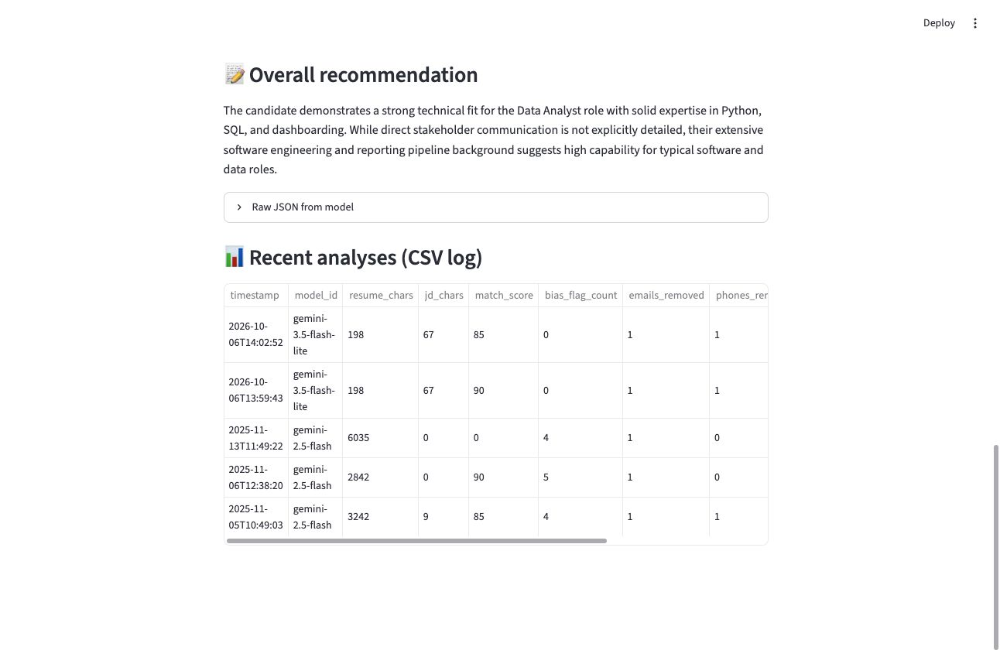
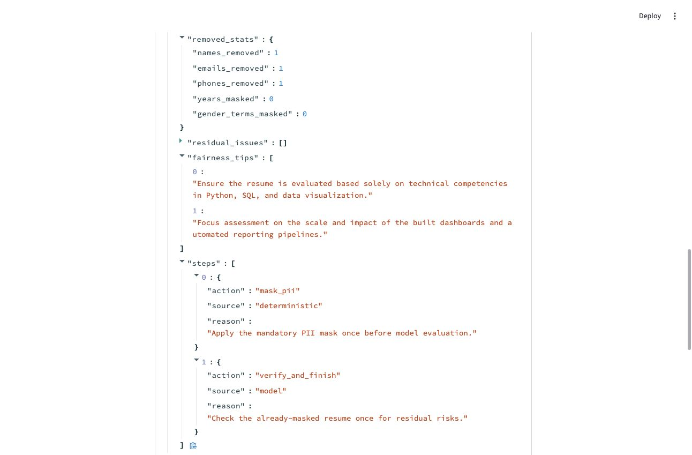

# FairHire – Hiring Fairness Demo

FairHire is a Streamlit demo that compares a resume with an optional job description, displays a model-generated fit score and skill groups, and records a basic bias audit. It is **not a validated hiring decision system**.

## Verified demo

These screenshots come from one local run on October 6, 2026 using a synthetic resume and `gemini-3.5-flash-lite`. The final run scored 85. A previous exploratory run in the CSV scored 90; model judgments can vary.

1. [Synthetic resume and job description](docs/demo-01-input.jpg)

   

2. [Rule-based PII preview](docs/demo-02-mask.jpg) — name, email, and phone are replaced with placeholders.

   

3. [Live score, skills, and fairness audit](docs/demo-03-results.jpg)

   

4. [Recommendation and analysis log](docs/demo-04-recommendation.jpg)

   

5. [Bounded filter trace](docs/demo-05-agent.jpg) — one deterministic masking step, then one model review.

   

The default `gemini-3.8-flash` returned a temporary 503 high-demand error during testing, so Flash-Lite was selected for this demo. No screenshots are mocked.

## How it works

```text
Resume text ──> deterministic masking ──> optional Gemini privacy review
                         │                            │
                         └──────── filtered text ─────┘
                                      │
                        Gemini scoring and skill draft
                                      │
                         strict Pydantic validation
                                      │
                     Streamlit result + CSV metadata log
```

- `fairhire_core.py` masks common resume-header or explicitly labeled names, email addresses, US-style phone numbers, years, and gender terms **before** any model call. This is heuristic masking, not full de-identification.
- With a key, the Gemini Interactions API receives the **filtered resume** for one privacy review and one scoring request. The original resume is not included in either prompt. A job description, if supplied, is sent for comparison.
- The model drafts the summary, score, skill groups, bias flags, and recommendation. Pydantic rejects missing fields, unexpected fields, wrong types, and scores outside 0–100. The app attaches its own masking statistics; the model cannot overwrite them.
- If privacy review fails, deterministic masking remains in force and the result is flagged for manual privacy review. If scoring or schema validation fails, the app shows an error instead of a fabricated score.
- Without a key, the preview still works, but `Analyze` requires Gemini. Each successful run makes at most two model requests.
- `fairhire_runs.csv` stores metadata and scores, not raw resumes or API keys. The example rows are synthetic.

## Run locally

Requires Python 3.11 or newer.

```bash
python3 -m venv .venv
source .venv/bin/activate
python -m pip install -r requirements.txt
```

Set a Gemini API key in your **server-side terminal**. On macOS or Linux, this avoids putting the key in shell history:

```zsh
read -rs "GEMINI_API_KEY?Paste Gemini key, then press Enter: "
echo
export GEMINI_API_KEY
streamlit run app.py
```

Open `http://localhost:8501`. Select `gemini-3.5-flash-lite` if the default model is overloaded. Never paste a key into the app's resume field or commit it to Git.

To reproduce the demo, paste this synthetic resume:

```text
Alex Taylor
Email: alex.taylor@example.com | Phone: 555-123-4567
Software engineer with 6 years of Python, SQL, and data visualization experience.
Built dashboards and automated reporting pipelines.
```

Job description: `Data Analyst: Python, SQL, dashboarding, stakeholder communication.`

## Test

```bash
python -m unittest discover -s tests -v
flake8 . --max-line-length=120 --ignore=E302,E305,W291
```

These tests use mocks and require no Gemini key. One synthetic identity-swap test checks that two resumes with identical skills but different header names/contact details become the same filtered text. This tests the masking rule only, **not** equal model scores or fairness across real applicants. GitHub Actions runs both commands. A separate live request was verified for the screenshots above.

## Docker

```bash
docker build -t fairhire .
docker run --rm -p 8080:8080 --env GEMINI_API_KEY fairhire
```

Export `GEMINI_API_KEY` in the host shell first, then open `http://localhost:8080`. Do not put the key literal in a Docker command. Without a key, the container can still show the deterministic preview.

## Limits and safety

- Name masking recognizes common headers and labels but can miss unusual layouts, non-US phone formats, addresses, schools, and other sensitive signals. Inspect the filtered preview before using real resumes.
- A model-generated score and “no obvious bias” message are **not** a fairness certification. FairHire does not benchmark disparate impact, calibrate scores, or justify real employment decisions.
- The model can still produce unsupported inferences even when its JSON is structurally valid. Human review is required.
- Availability, latency, API quota, and output vary by model and account. `gemini-3.8-flash` may return 503 during high demand.
- Session inputs live in Streamlit memory; CSV history is local and not an authenticated multi-user store. Do not use real applicant information in this public demo.

## Project files

- `app.py` — Streamlit UI, Gemini request, orchestration, CSV log
- `fairhire_core.py` — masking, bounded verification, strict schemas
- `tests/` — deterministic unit tests
- `docs/` — verified synthetic demo screenshots
- `Dockerfile` and `.github/workflows/ci.yml` — container and CI configuration
